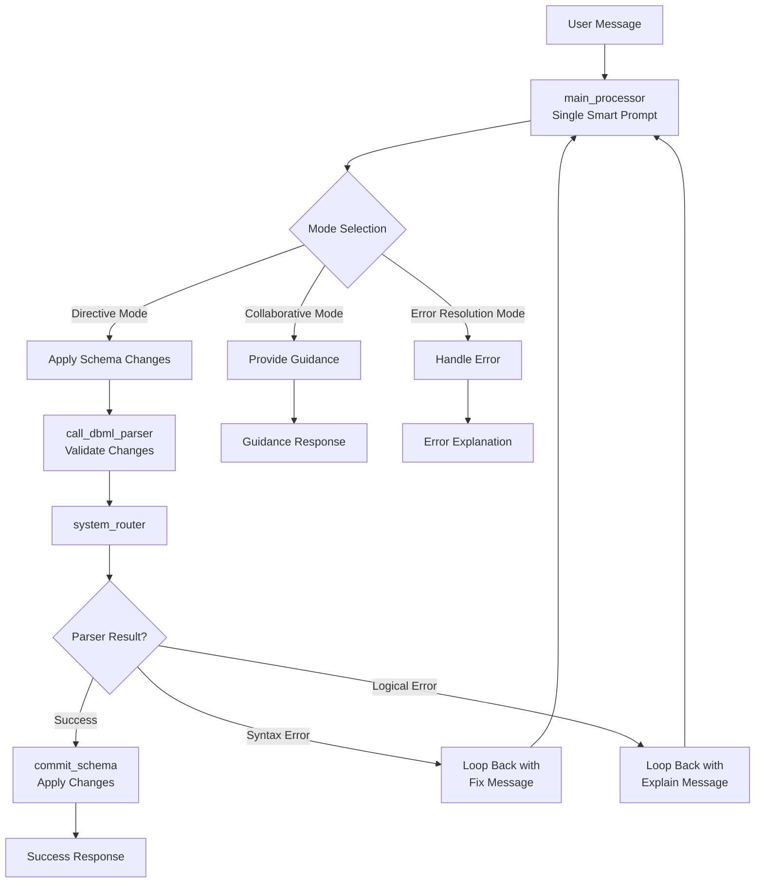

# 🗣️ Talking Tables Agent

A production-grade conversational ReAct agent for database schema management using a single smart prompt architecture built with LangGraph.

## 🎯 Overview

The Talking Tables agent provides an intelligent conversational interface for database schema management. It uses a unified prompt system that automatically determines the appropriate response mode based on user intent:

- **🔧 Directive Mode**: Apply schema changes directly with sensible defaults
- **💬 Collaborative Mode**: Explore database design possibilities and get guidance  
- **🔄 Error Resolution Mode**: Handle syntax errors with self-correction and explain logical conflicts

## ✨ Features

### Core Capabilities
- **Single Smart Prompt**: Unified conversational interface handling all interaction modes
- **Automatic Tool Binding**: Uses `llm.bind_tools()` for seamless LangChain integration
- **Self-Correction**: Automatic syntax error detection and retry logic
- **Context-Aware**: Maintains schema state and conversation history
- **Production-Grade**: Pydantic validation, comprehensive error handling, and monitoring

### Architecture Highlights
- **LangGraph Foundation**: Robust workflow orchestration
- **Node-Level Abstraction**: Clean separation of concerns
- **State Management**: Pydantic-based validation with LangGraph compatibility
- **HTTP Integration**: Parser service client with retry logic and health checks
- **Configuration Management**: TOML + environment variable support

## 🚀 Quick Start

### Prerequisites
- Python 3.11+
- Poetry (for dependency management)
- OpenAI API key
- DBML parser service (running on port 5001 by default)

### Installation

1. **Clone the repository**
   ```bash
   git clone <repository-url>
   cd talking-tables-agent
   ```

2. **Install dependencies**
   ```bash
   poetry install
   ```

3. **Set up environment**
   ```bash
   cp .env.example .env
   # Edit .env with your API keys
   ```

4. **Configure settings** (optional)
   ```bash
   # Edit config.toml for custom configuration
   vim config.toml
   ```

### Running Locally

```bash
# Interactive mode
poetry run python -m src.main

# Or using poetry script
poetry run talking-tables
```

### Example Interactions

#### Directive Mode (Apply Changes)
```
> Add a users table with email and name fields
✅ Schema changes successfully applied

> Remove the email field from users table  
✅ Schema changes successfully applied

> Add a posts table that references users
✅ Schema changes successfully applied
```

#### Collaborative Mode (Explore & Guide)
```
> What's the best way to model user authentication?
💬 For user authentication, I'd recommend considering several approaches based on your requirements...

> How should I structure tables for a blog system?
💬 A typical blog system benefits from these core entities and relationships...
```

## 🏗️ Architecture

### System Flow


### Core Components

- **`src/agent/prompts.py`**: Unified prompt template (single source of truth)
- **`src/agent/state.py`**: Pydantic state management with validation
- **`src/agent/graph.py`**: LangGraph workflow orchestration
- **`src/nodes/`**: Individual processing nodes
- **`src/tools/`**: Bound tools for LangChain compatibility
- **`src/services/`**: External service integrations

### Key Design Principles

1. **Single Prompt Architecture**: All user interactions flow through one intelligent prompt
2. **Automatic Tool Binding**: Uses `llm.bind_tools()` exclusively for LangChain compatibility
3. **Self-Correction Loops**: Syntax errors automatically retry with fixes
4. **Context Preservation**: Complete schema state maintained throughout interactions
5. **Production Robustness**: Comprehensive error handling and validation

## 🛠️ Development

### Setup Development Environment

```bash
# Install dev dependencies
poetry install --with dev,test

# Install pre-commit hooks
poetry run pre-commit install

# Run tests
poetry run pytest

# Type checking
poetry run mypy src

# Code formatting
poetry run black src tests
poetry run isort src tests

# Linting
poetry run flake8 src tests
```

### Project Structure

```
.
├── src/
│   ├── agent/          # Core agent logic
│   ├── nodes/          # Processing nodes  
│   ├── tools/          # Bound tools
│   ├── services/       # External services
│   ├── config/         # Configuration
│   └── main.py         # Entry point
├── tests/              # Test suites
├── .github/workflows/  # CI/CD pipelines
├── config.toml         # Configuration file
├── pyproject.toml      # Dependencies & metadata
└── langgraph.json      # Deployment config
```

### Running Tests

```bash
# All tests
poetry run pytest

# Unit tests only  
poetry run pytest tests/unit/

# Integration tests only
poetry run pytest tests/integration/

# With coverage
poetry run pytest --cov=src --cov-report=html
```

## 🚀 Deployment

### LangGraph Cloud

The agent is configured for deployment to LangGraph Cloud:

```bash
# Install LangGraph CLI
pip install langgraph-cli

# Deploy
langgraph deploy
```

### Environment Variables

Required for deployment:

```bash
OPENAI_API_KEY=your_openai_api_key
PARSER_SERVICE_URL=https://your-parser-service.com
LANGSMITH_API_KEY=your_langsmith_key  # optional
LANGGRAPH_CLOUD_API_KEY=your_langgraph_cloud_key
```

### CI/CD Pipeline

The project includes GitHub Actions workflows:

- **CI**: Testing, linting, type checking, security scans
- **Deploy**: Automatic deployment to LangGraph Cloud on main branch

## 📊 Monitoring

### LangSmith Integration

The agent integrates with LangSmith for observability:

```python
# Automatic tracing enabled when LANGSMITH_API_KEY is set
LANGSMITH_API_KEY=your_key
LANGSMITH_PROJECT=talking-tables-agent
```

### Health Checks

```bash
# Check parser service health
curl http://localhost:5001/health

# Agent health check built into main.py
```

## ⚙️ Configuration

### config.toml

```toml
[agent]
model = "gpt-4"
temperature = 0.1
max_tokens = 4000

[parser_service]
base_url = "http://localhost:5001"
timeout = 30
retry_attempts = 3

[deployment]
environment = "production"
log_level = "INFO"
```

### Environment Variables

See `.env.example` for all available environment variables.

## 🤝 Contributing

1. Fork the repository
2. Create a feature branch (`git checkout -b feature/amazing-feature`)
3. Make your changes
4. Run tests and linting (`poetry run pytest && poetry run black src tests`)
5. Commit your changes (`git commit -m 'Add amazing feature'`)
6. Push to the branch (`git push origin feature/amazing-feature`)
7. Open a Pull Request

## 📝 License

This project is licensed under the MIT License - see the [LICENSE](LICENSE) file for details.

## 🙏 Acknowledgments

- Built with [LangGraph](https://github.com/langchain-ai/langgraph) for workflow orchestration
- Uses [LangChain](https://github.com/langchain-ai/langchain) for tool binding and LLM integration
- Pydantic for robust data validation
- Poetry for modern Python dependency management

## 📞 Support

For questions or issues:

1. Check the [documentation](docs/)
2. Search [existing issues](https://github.com/your-repo/issues)
3. Create a [new issue](https://github.com/your-repo/issues/new)

---

Built with ❤️ using the single smart prompt architecture for maximum simplicity and robustness.